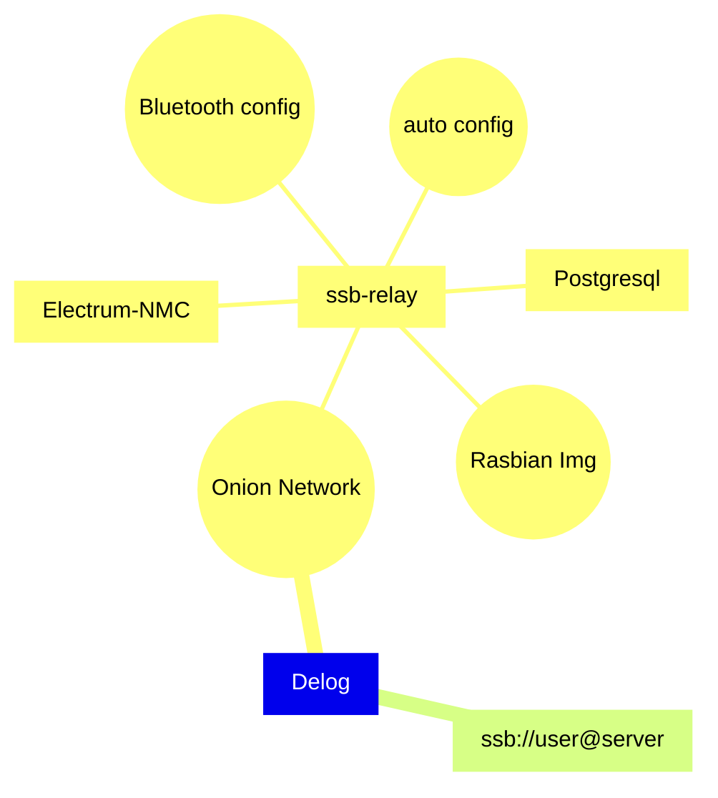

From the inception of the Internet, I've been a firm believer in its social capabilities. The Social Web has always appealed to me, and the advent of Social Networks, despite my initial skepticism, was no exception. Although I was wary of Facebook's dominance, I was open to sharing photos, but couldn't bring myself to use Instagram due to my commitment to the ideals of the Internet.

Few years ago I discovered self-certified social network and in particular the [Scuttlebut protocol](https://scuttlebutt.nz/docs/protocol/). I had been very impressed on it.

An ideal social-network should be built on self-certified identities as Daniel J. Bernstein shown possible, and many people implemented, I think in particular to Frank Denis' Libsodium and Dominic Tar's Secure Scuttlebut (SSB)

As I observed the layers of technological evolution accumulate, I had to acknowledge the potential of creating something meaningful by leveraging some architectural concepts and ideas I had encountered. Here is my journey:

A decentralized social network should primarily operate through a mobile device interface. However, to ensure constant online presence and accessibility, a server instance is necessary. We need as many instances as possible. Everyone should be able to host an instance without incurring additional monthly costs. Ideally, anyone with a fiber Internet connection should be able to run their instance. While most users have personal computers that aren't always online, some have dedicated "always on" personal computers. However, the diversity in operating systems can pose limitations.

Raspberry Pi model 4 has become available again post-pandemic, and Raspberry Pi 5 is now offered at a higher price. It's possible to enhance the Raspberry Pi 4 with a Serial-ATA solid-state disk, a decent alimentation and box, which, for a reasonable price, delivers excellent performance. Raspberry provides a platform, and an operating system, Rasbian, that we can both expect to be available long-term. So one point is to build continuous delivery for ssb-relay Rasbian Pi packages (and soon Rasbian image) that run an SSB server integrated with its Android app.

A self-certified social network solution should be straightforward for non-technical users to set up. It should be configured on a local network, similar to how I set up my home vacuum robot. A common approach is to allow Wi-Fi configuration via Bluetooth Low Energy, taking advantage of the features of both Raspberry boards and mobile devices.

Once this is done, the remaining challenge is to enable network traversal over the Wi-Fi/fiber provider box. This allows the ssb-relay to be accessible from the Internet without depending on a centralized third-party. There are several ways to accomplish this. One alternative that I find particularly appealing is the Tor network's Onion services. I've incorporated this into my Raspberry Pi image and made the hostname accessible to the mobile app via Bluetooth. 

However, Onion names are not user-friendly, so I've added Namecoin to the stack, specifically Electrum-NMC. Developers like Jeremy Rand have [done significant work](https://www.namecoin.org/resources/presentations/36C3/Adventures_and_Experiments_Adding_Namecoin_to_Tor_Browser_36C3_CDC.pdf) on this to make name resolution both fast and energy-efficient.

The software on the appliance should guarantee the uniqueness of the instance name, while Namecoin ensures server name uniqueness at the network level.

With a bit of integration, it's possible to configure the mobile app to claim the server, register on the ssb-relay as a machine administrator, and automatically set up everything else, including a Namecoin Wallet. I've previously incorporated Postgres into the Secure Scuttlebutt (SSB) stack and established a functional invite workflow with the mobile app. I've also developed a Kotlin [SSB Android: Delog](https://github.com/ssb2dmba/delog) that can connect to Tor ([kudo to Matthew Nelson for its terrific library](https://github.com/05nelsonm/kmp-tor)), and implemented Apache Tuweni's SSB, among other classical features (link/video preview, draft editing, multiple identities, ...)

Currently, there's still much work to be done. This includes building the mobile client for Electrum-NMC to get name resolution functioning, enabling in-app name purchases, and completing certain aspects of the SSB protocol implementation.

Unit testing and operational development have been incredibly helpful. I'm currently working on producing a Debian package repository via a single commit on the main GitHub branch.

My plan is to continue with the registration of an EU non-profit organization that will construct and manage the appliance, and potentially assist in acquiring and using Namecoin.

Ultimately, I hope to create a fully decentralized service akin to popular social networks and finally share pics on my public and private walls.