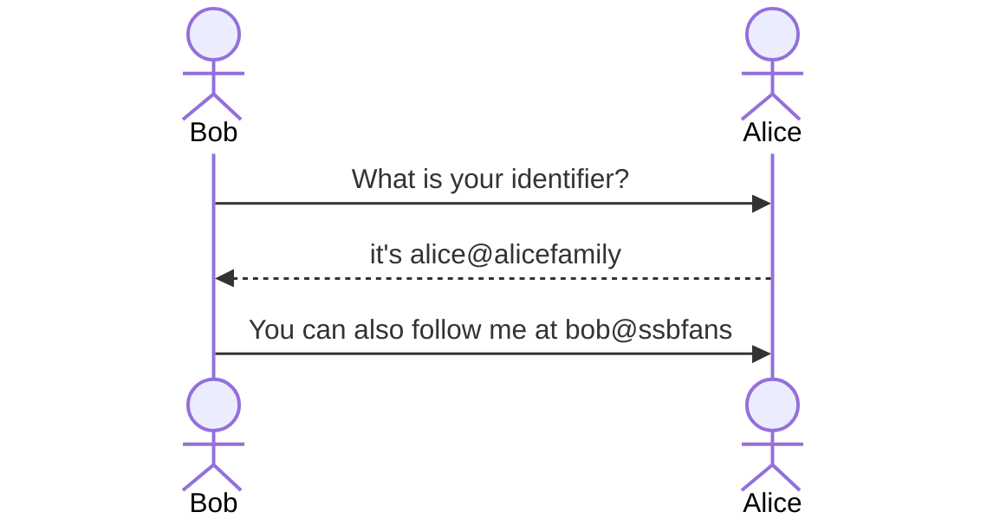
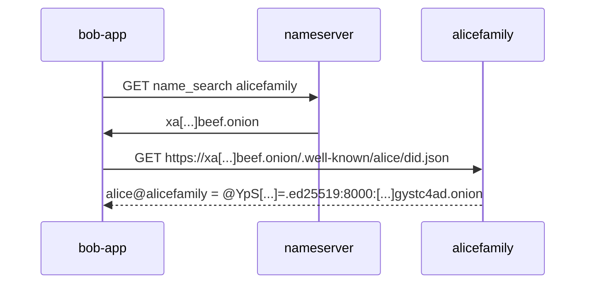
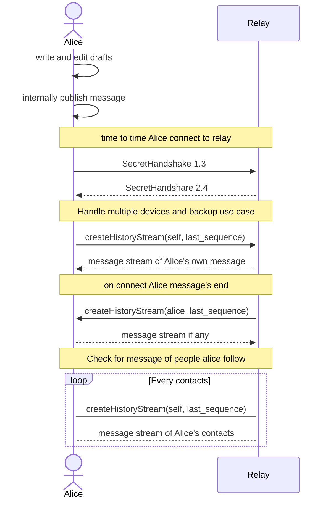

## Introduction

In the instantaneous transmission of news via the Internet, social networks are essentially commercial enterprises.
There are entities that serve as an intermediary for the transmission of information and give their name to a network.
Although the system works well in most cases, it suffers from weaknesses due to the use of a trusted third party for identification and moderation.

In order to guarantee your identity and the moderation of the service against illegal content or going against the interests of the organizer of the social network, you are asked for your personal information. Sometimes more than necessary to ensure the operation of the service and the service costs are paid for by advertising, not objective information. Costs are partly absorbed by the resale of personal information, possibly 
[for questionable purposes](https://www.washingtonpost.com/dc-md-va/2023/03/09/catholics-gay-priests-grindr-data-bishops/) 

Often geographically localized, [sometimes under government control](https://www.bloomberg.com/news/articles/2012-02-19/china-asks-baidu-to-help-govt-control-information-on-internet#xj4y7vzkg), social networks as they exist cannot avoid active moderation. The risk of being influenced by the platform or by organizations wishing to influence the platform is significant, as shown by [the Cambridge Analityca case](https://www.nytimes.com/2018/04/04/us/politics/cambridge-analytica-scandal-fallout.html). All this has a cost.

However, we believe that social networks can bring human benefits, for everyone to know the other better, to find information, even to build a collective intelligence. There is a large amount of research investigating the negative effects of social media on behavior, we believe they also have positive effects and a net result shall be expected, as said Sir Francis Bacon, *Knowledge itself is power*.

Useful because spreading global knowledge, social networks can be improved. Starting from the prior art, we propose to continue the path, in particular on what seems to us to be a very good construction, the Secure Scuttlebut (SSB) protocol. There is an avenue for building an open product, a decentralized, censorship-resistant, legal social network of the future. we propose a reference SSB2 client and server under the umbrella of a non-profit organization.

## History

The idea in cryptography that private keys correspond to public keys is attributed to [Diffie and Hellman (1976)](https://dl.acm.org/doi/abs/10.1145/1499799.1499815). Signing a message with a private key proves that you are the author, having been and being in possession of the key. Another person cannot sign a message for me without knowing my private key. The signatory then constitutes an identity. It is therefore no longer necessary to have recourse to a trusted third party to organize the integrity of your messages.

It is going to be possible to export and import a private key in the form of a mnemonic phrase.

In 2008, Daniel J. Bernstein and his team publish [the use of Edward's cryptographic elliptic curve](https://link.springer.com/chapter/10.1007/978-3-540-85053-3_16) which will be followed by a high-speed cryptographic library. The advantages of elliptic curve cryptography over other cryptographic methods, such as RSA, are equivalent security with shorter keys and increased computational efficiency. For example, a 256-bit ECC key provides a similar level of security as a 3072-bit RSA key. Soon after he deliver a reference software library, "Not a Cryptographic Library" (NaCl). library ([Daniel J. Bernstein, 2012](https://link.springer.com/chapter/10.1007/978-3-642-33481-8_9)),  demonstrating this mathematical work, through practical functions.


Soon after, Frank Denis published ["Introducing Sodium, a new cryptographic library"](http://labs.opendns.com/2013/03/06/announcing-sodium-a-new-cryptographiclibrary/) (2013) and [LibSodium](https://doc.libsodium.org/), a modern portable cryptographic library based on the interfaces of NaCl.

On top of this, Dominic Tar will publish [Secret Handshake Protocol](https://dominictarr.github.io/secret-handshake-paper/shs.pdf)(SHS also known as SecretStack).

The server's public key allows secure access to remote functions. Dominic Tar publishes a reference implementation to a not simple problem, a client-server remote procedure execution. It can be defined as a software construct that makes remote command execution simple by using public key authentication, the public key having been authorized for certain capabilities (reading messages, posting a new message, for example).

Additionally, he publish the Secure ScuttleBut (SSB) protocol. SSB defines itself as a subjective toolbox for building a social network. The library offers all the verbs to build a social network (follow, block, present, invite, ...).

 For a quick description of the Secure Scutllebut protocol, SSB see [the white paper in 4mn](https://web.archive.org/web/20190716152343/https://infourminutes.co/whitepaper/scuttlebutt), and [the guide of the SSB protocol](https://ssbc.github.io/scuttlebutt-protocol-guide/).

## Overview of current status

Alas, despite all its capabilities we have yet to find a popular application of the SSB protocol. There is no social network based on the SSB protocol with a significant number of users. Is it because of the lack of sufficiently comprehensive implementation?

The Bluesky initiative has put together [a matrix of existing decentralized projects](https://gitlab.com/bluesky-community1/decentralized-ecosystem). They are all [less popular than centralized networks](https://datareportal.com/social-media-users), all commercially oriented.

 - Mastodon is currently popular, but not without encountering problems.
It does not really offer a decentralized identity, which is ultimately carried by the instance.
It also lacks a mobile-optimized, offline user interface.
[The ActivityPub protocol](https://www.w3.org/TR/activitypub/) [does not facilitate uniformity](https://mastodon.social/@atomicpoet/110007834836602630) and applications do not federate completely all together. Mastodon is not optimized for mobile devices first.

- [The Nostr protocol](https://github.com/nostr-protocol/nostr) looks a lot SBB but [decided to change](https://github.com/nostr-protocol/nostr#the-problem-with-ssb-secure-scuttlebutt), the message format, and not to resume SHS as is. Nostr does not offer a reference implementation, but relies on a still emerging ecosystem of clients and servers.
Nostr is different from SSB seems to deprive itself of tools present in SSB, such as invitations, attachments or the message chain. It does not offer server-to-server communication, so clients connect to multiple servers. It interestingly has an essential property of censorship resistance of the network but seems sensible to spam.

- [The AT protocol](https://atproto.com/), offers a new communication layer. A lexicon is provided for remote functions and http-based services. Product availability is expected soon. If the AT protocol seems promising in terms of performance, for example when it will use [QUIC](https://en.wikipedia.org/wiki/QUIC), it is however still only in design. Both solutions do not address yet the questions of "attachments", attachments like images, videos and other files, yet.

Fact that there are other initiative tend to prove that there is a need for a product. SSB current protocol lacks verbs such as `feed-delete` to erase our entire identifier, `post-edit`, `post-delete` in order to comply with basic users requirements (i.e. European laws kindly make this mandatory).

## Methodology

Starting from SSB we propose a reference client and server under the umbrella of a non-profit organization. All code named below is available here: https://github.com/ssb2dmba

- **delog**, a mobile client, indeed, [86% of Twitter usage is on the phone](https://www.broadbandsearch.net/blog/mobile-desktop-internet-usage-statistics).
- **ssb-relay**, a reference server. In order to be able to manage a large number of messages, we propose to support them on a relational database (i.e. [Postgres](https://www.postgresql.org/)). Such servers shall be easily installable, for exemple over a Rasberry PI a Tor for network addressing without having a domain name and a static ip adress (the more network has server the healthiest it is).
- **dmba**, a non-profit organization under European Union laws.


## Decentralized identifiers 

It is practical in a social network to have a readable name, an alias. Email and Mastodon for example does that well.



We see that social network identifier are written in the form user@domain and can be easily exchanged.

Network is going to:
- ensure name uniqueness
- map user@domain to a cryptographic public key (pk) to an onion domain

For this:
- relay ensure name uniqueness inside a domain 
- relay that serve over Tor register their name through the Namecoin network. This is the recommended way to use the network.
- Relays that serve over public DNS get their name uniqueness handled by the public DNS service


Pseudonym verification is provided by posting a simple request to the server associated with the alias for verification. 




This system is [standardized by the W3C](https://w3c-ccg.github.io/did-method-web/) and known as [web-did](https://en.wikipedia.org/wiki/Decentralized_identifier)

- domain names are unique and signed over the Namecoin network
- usernames are unique and signed by the user exposing its public key and the relay


 That me that social graph would be constituted of decentralized identifiers such as bob@cryptofamily, a request of the client on well-known address would resolve to a history of public keys and a set of relays.  

## Scuttlebut functional rules (SFR)

The idea is to define the communication rules on top of the protocol between clients and servers.
For example, if you want to use the server as a backup and replication hub between several machines, you can fulfill the need with a functional rule.


*Example of a functional rule, the behavior of the client and the server must follow the following sequence*, implementing this sequence allow client backup on relay (and also cross client uses):



There are other rules that may be useful. The method consists in defining its rules using an organization that surrounds the emergence of SFR. 
- Users should own their data, and give limit trust in relay.
- Users should own their social graph, and not even discard it. One possibility not to disclose the social graph it to let the relay act as a proxy. It is possible by letting client contact relay server where a decentralized identity is replicated.

## Network topology 

In order to transmit the information quickly, and to prevent censorship users shall use several relay servers. 
- The network can be defined like being similar to a mail network where relay act as point of presence on the network.
- Client can connect to multiple point of presence.
- Relays may be notified by another relay
- Relays can check other relays for new messages

Network topology would look like:

```mermaid
flowchart LR
    Alice  --> relayA
    relayA --> Alice
    Alice  --> relayB
    Bob --> relayB
    relayB --> Bob
    relayA <--> relayB
    relayB --> Tom & Nick & Joe
 ```

Alice is kept is sync with relay A. It also send private messages directly to Bob's relayB. RelayB get also notified of Alice activity through relayA. Tom, Nick and Joe also follow Alice and Bob.

## Decentralized Micro Blogging Association

The Decentralized Micro Blogging Association. DMBA organize the emergence and also the quality assurance of the reference software. One of the hypotheses to explain the weaknesses of existing social networks is that an entity should not dictate the rules of the network alone.

Same as in much software development community, functional rules and protocol changes are accepted by consensus, through the process of improvements proposals, formalized in a tested implementation, as code (implementations are integrated into the source code following the traditional merge request process with peer approval).

Ideally this operation would be democratic, built on exchanges, framed by rules responsible for directing the inflow and outflow of exchanges and changes:
Users define rules, rules become software, and the software become a network.

Our methodology is therefore based on three tools:
- Mobile clients optimized for battery consumption, native.
- Decentralized servers based on a large capacity relational database (such as Postgres),
- a non-profit association which organizes the vote on the operating rules of the software, and therefore of the network.

## Resistance to spam, online harassment and toxicity.

Each user chose who he follows. He receives in his thread only the messages of the friends followed. Spam cannot arrive in the mailbox unless the user specifically asks to follow.

```mermaid
    flowchart TD
    G[periodically check for new messages] --> FriendsDB
    FriendsDB[(Friends list)] --> B
    B{more relays?} -->|Yes| D
    E[/check friends relay messages/] --> F
    D{more friends?} --> |yes| E
    D{more friends?} --> |no| B
    F[(message storage)]
    B{more relay?} -->|No| Z
    F --> |read| User
    Z(done)
    FriendsDB[(Friends list)] --> |unfollow| User
    User[/User\] --> |follow| FriendsDB

```
This simple mechanism, expressible as an SFR, should make simple bots largely useless, why post if no one is following them?


 ## Find threads

Having a social network where you only receive messages from people you follow is a good way to limit spam or harassment. But with only that how to discover new threads?

- It has already been proposed to augment the SSB protocol with the `search` verb. The Postgres server offers some of the most powerful full-text search on the market.
- It has already been proposed to use links to quote and open threads or messages (ssb-uri) as hypertext links, when they begin with ssb://.
This would allow discovery of the network from the inside and from the outside. A link to a thread or a link to a message opens a compatible application. 
- Replies to messages make possible to know new contacts. Without prejudging the rules that will be implemented, here is an example:
  - *response threads are fed by all messages known to the relay when querying the thread of the message" - "it is possible to block"*
  - *the server understands answers blocked by the author as blocked for all, by the reader as blocked by him*


Toxicity can be contained with a blocking mechanism per entire relay server, probably for cases falling within the legal framework...
The perpetrator would then lose all reputation, a severe penalty.
Conversely, if the relay practices too much censorship, according to users, it will be left because of its bad reputation.
Brief balances of moderation should be formed like so many spheres, nevertheless communicating.

The use of call limitation devices should be an integral part of the relay server for the protection of denial of service type attacks.


## Peer discovery

What if all relay servers could see each other and "shake hands", may be only on invite ?
The addition of an implementation, in the pub server, of a discovery service by "Distributed Hash Table" ([definition](https://en.wikipedia.org/wiki/Distributed_hash_table), [example of implementation](https://www.npmjs.com/package/hyperswarm)) seems completely relevant.
- Invitation and automatic follow-up to discover relay servers between them?
- What rules for the use of the epidemic diffusion algorithm?
- If the SSB network is essentially based on the fact that the clients pull the messages, shouldn't a "push" type operation be introduced between the relay servers to optimize transmissions? What are others optimizations to be done ?

## Conclusion


SSB2 appears as an interesting avenue of research. With a few improvements, it is possible to bring the network into legal compliance, users basic requirements, while having a strong decentralization.
The issues of censorship resistance, the use of netiquette, trust, without third parties, or key rotation can be answered and same is true for deleting and modifying messages online. Secured online voting would be a Graal and command protocol extension are unlimited, home based backup could help in archiving and storing medias from the mobile devices. The quality of the experience should be crucial and that might be a long road.
