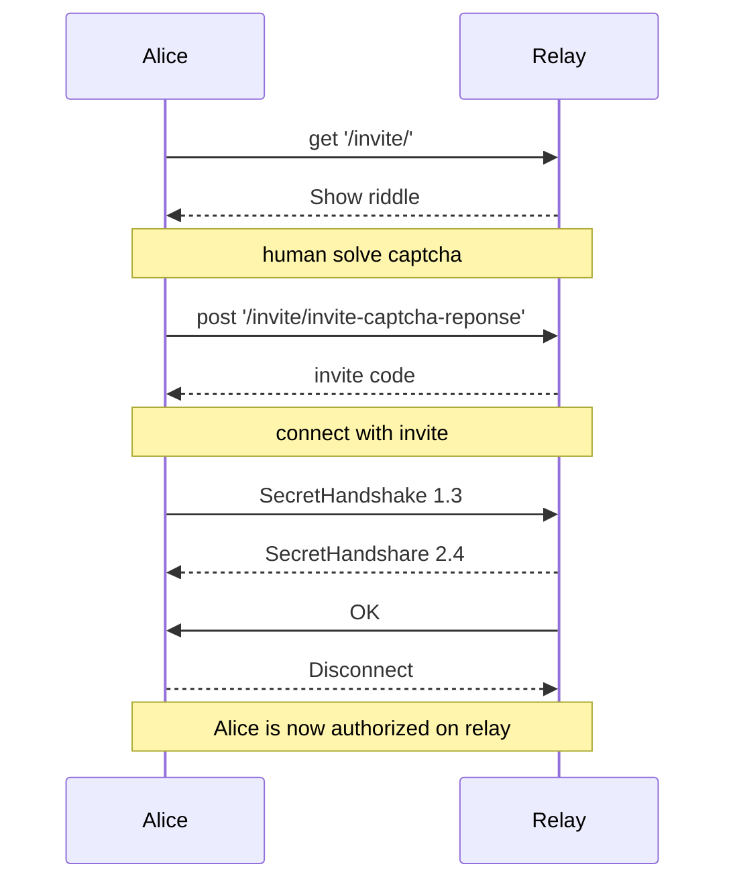

The invite-code client and relay exchange specification describe the delivery and usage of invites-code to clients.
- [Invites-code are specified here](https://ssbc.github.io/scuttlebutt-protocol-guide/#invites)
and can be redeemed on a server. Once a server get back an invitation it will follow the client and as described in [message flow specification](spip-01.md), server will allow authentication of the client and further network communication processing.


- Relay serve a dedicated page for querying invite at GET `/invite`.
- The `/invite/` page present a riddle intended to be solvable by a human only.
- The `/invite/` page must be human-readable webpage.
- The `/invite/` page must pose a session cookie, client must present back the session cookie on the next step.
- Relay expect client to send POST http query `/invite/invite-captcha-reponse` with the variable `captcha` in POST `body` containing the human solved puzzle answer.
- Clients should immediately connect to server using the `connectWithInvite` method.
- Server must accept `connectWithInvite` and respond by internally publishing a follow client message.
- Client must then immediately disconnect.
- Server must accept SSB connection from client it follow and allow them the following methods: `follow`, `createHistoryStream`


In NodeJS this translates to this:

```javascript
    app.get('/invite/'), (req: Request, res: Response) => {
        // remember riddle response in server session              
    });

    app.post('/invite/invite-captcha-reponse', (req: any, res: Response) => {
        var riddleResponse = req.body.captcha;
        // compare posted response with response expected in server session 
    });
```

Using a sequence diagram this translates to this:




- Upon success, `/invite/invite-captcha-reponse` must put the invite, as-is in its HTML `title` tag and may in the visible part of the webpage.
- Upon failure, server must not generate and deliver invite.
- Client may request and use invite at anytime to be followed and authenticated by the relay.
- `/invite/` and `/invite/invite-captcha-reponse` must be valid W3C HTML.
- The `/invite/` and `/invite/invite-captcha-reponse` page must be served over HTTPS and port 443 for public domains
- The `/invite/` and `/invite/invite-captcha-reponse` page must be served and over HTTP and port 80 for onions domains.
- The `/invite/` and `/invite/invite-captcha-reponse` page must optimize for mobile with small screen devices

