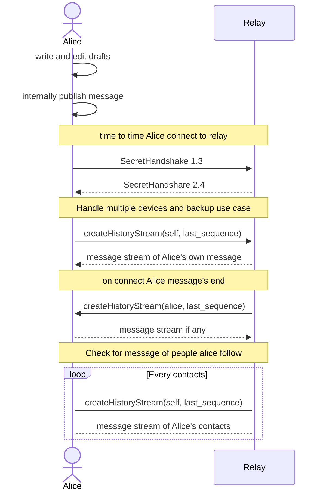

The message flow specification describes the flow of messages. 

- Message flow essentially work with the `createHistoryStream` and `publish` SSB [RPC method described here](https://ssbc.github.io/scuttlebutt-protocol-guide/#createHistoryStream).

- In order to prevent a race condition:
    - Server must wait for clients owns `createHistoryStream` response end to emit his own. 
    - Client may finalize publication at a time when the server is synced.
- Both client en relay must not check for sequence continuity. This is important for several use cases such as message delete.

